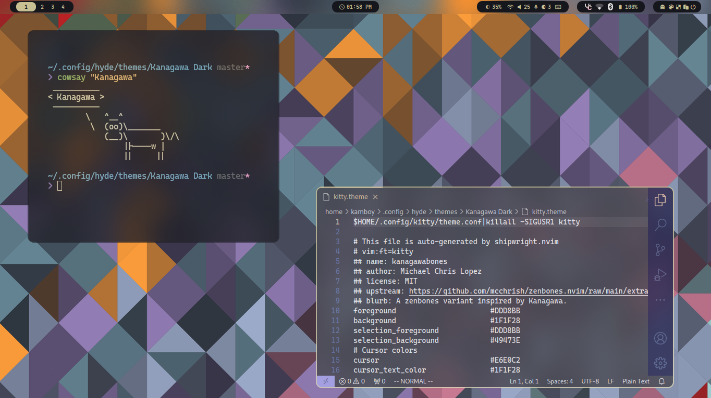

# Kanagawa Theme for Hyde!

> [!NOTE]
> This is my first custom theme for Hyde, so please submit issues!

## Installation

### Git Clone (Recommended for now)

1. Clone the Repo into the hyde themes directory: `git clone https://github.com/TheKamboy/hyde-kanagawa.git ~/.config/hyde/themes/`
2. Refresh the cache: `Hyde cache rebuild`

### Hyde Theme Patch

> [!IMPORTANT]
> This theme is not in the Theme Patch yet (correct me when I'm wrong). This is here for future reference

1. Open the Hyde Theme Patch menu: `Hyde theme patch`
2. Select Kanagawa

## Sources

- [Wallpapers](https://www.deviantart.com/niivu/art/Kanagawa-for-Windows-11-1021605687)
- [Kvantum Theme](https://github.com/candyclaws/Utterly-Kanagawa/)
